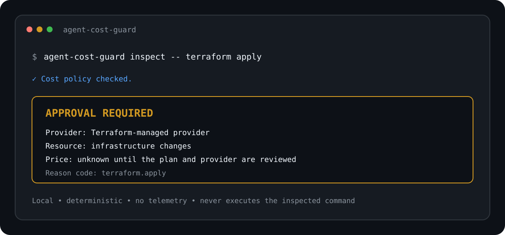

# Agent Cost Guard

[](https://github.com/incline-ltd/agent-cost-guard/actions/workflows/ci.yml)
[](https://nodejs.org/)
[](LICENSE)

**Stop supported cloud-cost actions proposed by coding agents until a person
reviews the approval details.**

`agent-cost-guard` is a local, deterministic hook and CLI for Claude Code,
Codex, Cursor, GitHub Copilot, and any agent with a before-tool hook. It has no
account, API key, LLM, telemetry, network call, or runtime dependency.



## 60-second demo

```bash
git clone https://github.com/incline-ltd/agent-cost-guard.git
cd agent-cost-guard
npm ci
npm run build
node dist/bin.js doctor
node dist/bin.js inspect -- terraform apply
```

The last command returns `APPROVAL REQUIRED` with exit code `2`. The proposed
`terraform apply` is inspected as text and is never executed.

This repository is a public preview. The npm package name is declared in the
project metadata but is not published yet; use the source checkout until the
first package release.

## Support at a glance

| Surface | Protocol and package tests | Live host proof | Cost-match behavior |
| --- | --- | --- | --- |
| Claude Code and Claude Desktop Code | Passed | Pending | Ask the user; policy blocks deny |
| Codex | Passed | Pending | Deny with approval details because hooks cannot ask interactively |
| Cursor | Passed | Passed: bypass command denied | Deny with approval details; current host race is documented |
| GitHub Copilot CLI | Passed | Pending | Ask the user |
| GitHub Copilot for VS Code | Passed | Pending; hooks are Preview | Ask the user |
| Generic CLI and CI | Passed | Passed: packed install smoke | Exit `0`, `2`, `3`, or `64` |

“Passed” in the protocol column means adapter fixtures, contracts, and packed
package tests pass. It does not claim that every tool path in that host can be
intercepted. See [Integrations](docs/INTEGRATIONS.md) for exact host limits and
safe live-test instructions.

## Current policy coverage

| Provider | Covered actions |
| --- | --- |
| AWS | EC2 instances, spot requests, volumes, snapshots, NAT gateways, reservations and resizing; EKS clusters; ECS tasks; ELBv2 load balancers; RDS databases, snapshots and capacity; ElastiCache; DynamoDB tables; Lightsail instances; OpenSearch domains; Redshift clusters; S3 buckets; autoscaling capacity; Lambda provisioned concurrency; Savings Plans |
| Cloudflare | Worker deploys, D1, R2, KV, Queues, Hyperdrive and Tunnels |
| Terraform | `apply` plus added resource blocks in HCL and Terraform JSON |
| Generic tools | Credit purchases, paid-plan upgrades, backups, snapshots, scale-ups, cost-bearing structured tool names and guard-bypass attempts |

The guard does not currently provide first-class GCP, Azure, Vercel or Fly.io
command rules. It also cannot know live account state or calculate an exact
bill. Unsupported actions are a coverage gap, not proof that an action is free.

`agent-cost-guard` checks a command, tool call, or Terraform file change before
it runs. It returns one of three decisions:

- `allow`: no cost rule matched;
- `approval-required`: the action may create or increase a bill; or
- `block`: the action tries to bypass the guard, or strict inspection could not
  safely understand it.

Inspection is local and deterministic. The package has no account, API key,
LLM, telemetry, network call, or runtime dependency.

## Actual use cases

In simple terms, this tool stops a proposed paid action and returns the exact
details a person must review before deciding how to proceed.

- An agent tries to start an AWS server, database, volume, snapshot, or bucket.
  The guard asks for approval when the host supports it, or safely denies the
  action with the approval details.
- An agent tries to deploy a Cloudflare Worker or create D1, R2, KV, Queue,
  Hyperdrive, or Tunnel resources. The guard asks first.
- An agent runs `terraform apply` or adds a Terraform resource. The guard asks
  before the change reaches a provider.
- An agent tries to buy credits, upgrade a paid plan, create a backup, or raise
  replicas, storage, throughput, workers, or autoscaling limits. The guard asks
  first.
- An agent only lists or describes existing resources. The guard adds no extra
  prompt, while the agent's normal permission system still applies.
- A cloud coding agent has no person available to answer. The guard denies the
  cost action and returns the complete approval details for the job log.
- A CI job or another agent can send structured JSON and use the stable decision
  plus exit code as a policy gate.
- A maintainer can list and explain every rule to audit exactly what the guard
  checks.

The tool does not know the live state of a cloud account and does not calculate
an exact bill. It states when price is unknown instead of inventing one.

## How it fits

```text
coding agent proposes an action
  -> agent-cost-guard inspects the action as untrusted data
  -> deterministic rules return allow, approval-required, or block
  -> the host agent keeps its own permission checks
  -> only the host may run the action
```

A core `allow` is never automatic approval. Hook adapters emit no permission
override for an allow result, so Claude Code, Codex, Cursor, or GitHub Copilot
keeps control of its normal permission flow.

## Tech stack

- Node.js 20 or newer
- TypeScript
- npm, as one package rather than a monorepo
- Vitest for tests
- ESLint for static checks
- versioned JSON rules under `rules/`
- no production dependencies

See [Architecture](docs/ARCHITECTURE.md) for the data flow and folder
responsibilities.

## Run from source

```bash
npm ci
npm run build
node dist/bin.js --version
node dist/bin.js doctor
```

The npm package name is `@ashishkaloge/agent-cost-guard`; the executable remains
`agent-cost-guard`. The package is prepared for a public release but is not
published by this repository change.

After a release, install it in the project that owns the agent configuration:

```bash
npm install --save-dev @ashishkaloge/agent-cost-guard
```

## Check the local guard

Run the built-in local check before connecting an agent:

```bash
node dist/bin.js doctor
```

```text
Agent Cost Guard doctor

Core inspection: checking... working
Claude Code adapter: checking... working
Codex adapter: checking... working
Cursor adapter: checking... working
GitHub Copilot CLI adapter: checking... working
GitHub Copilot for VS Code adapter: checking... working

Safe command decision: allow
Cost command decision: approval-required
Guard bypass decision: block

Local verification: passed
Host hook installation: not checked
```

`doctor` verifies the local policy and protocol adapters. It does not claim that
a host application has loaded the hook. Use the safe host checks in
[Integrations](docs/INTEGRATIONS.md) to prove that connection.

In a terminal, human `inspect` commands briefly show `Checking cost policy...`
before the decision. JSON and hook modes stay silent except for their strict
machine-readable output.

## Inspect a command

```bash
node dist/bin.js inspect -- aws ec2 run-instances \
  --image-id ami-00000000000000000 \
  --instance-type t3.small
```

```text
Agent Cost Guard
Decision: APPROVAL REQUIRED

Reason:
Cost confirmation required:
Provider: AWS
Resource: EC2 instance(s)
Billing: recurring and usage-based
Price: unknown because region, instance type, count, and runtime determine the cost

Reason code: aws.ec2.run-instances
Matched rules:
  - aws.ec2.run-instances (aws ec2 run-instances --image-id ami-00000000000000000 --instance-type t3.small)
```

Use `--json` for machine-readable output:

```bash
node dist/bin.js inspect --json -- terraform apply saved.plan
```

Use `--strict` when incomplete shell syntax must block instead of returning a
decision marked as incomplete:

```bash
node dist/bin.js inspect --json --strict -- 'terraform apply "unfinished'
```

Exit codes are stable:

| Code | Meaning |
| ---: | --- |
| `0` | No cost rule matched |
| `2` | Explicit cost approval is required |
| `3` | Blocked by policy or strict inspection |
| `64` | Invalid CLI usage or invalid request JSON |

## Inspect structured JSON

The generic JSON command reads one inspection request from stdin. It supports
shell actions, structured tool calls, and file changes without running them.
Use `source: "generic"` when integrating another agent through its before-tool
hook or a wrapper you control.

```bash
printf '%s' '{"source":"generic","mode":"non-interactive","action":{"kind":"tool","name":"create_database","arguments":{"name":"example"}}}' \
  | node dist/bin.js inspect-json --strict
```

The TypeScript API exports the same validated request and decision contracts.

## Use it with coding agents

Ready-to-copy configurations are included for:

- [Claude Code](examples/claude-code/settings.json), including the Code tab in
  the Claude desktop app
- [Codex](examples/codex/hooks.json)
- [Cursor](examples/cursor/hooks.json)
- [GitHub Copilot CLI](examples/github-copilot/copilot-cli.json)
- [GitHub Copilot in VS Code](examples/github-copilot/copilot-vscode.json)
- [GitHub Copilot cloud agent](examples/github-copilot/copilot-cloud.json)

Hook commands read the host's pre-tool JSON from stdin and write only valid host
protocol JSON. Hooks are strict by default. `--no-strict` is an explicit
fail-open option for evaluation, not the recommended enforcement setting.

Setup, host decision behavior, limitations, and safe test commands are in
[Integrations](docs/INTEGRATIONS.md). First-class here means a maintained
adapter, copyable configuration, fixtures, and package-level tests. It does not
mean that every tool path in every host can be intercepted.

Found a missed cost action or a wrong decision? Use the
[wrong-decision report](https://github.com/incline-ltd/agent-cost-guard/issues/new?template=wrong-decision.yml).
Tested a host or agent version? Share the result through the
[host-compatibility report](https://github.com/incline-ltd/agent-cost-guard/issues/new?template=host-compatibility.yml).

## Inspect the policy

```bash
node dist/bin.js rules list
node dist/bin.js rules list --json
node dist/bin.js rules explain aws.ec2.run-instances
```

The current rules cover focused AWS, Terraform, Cloudflare, and generic cost
actions. Each of the 47 rules has positive, negative, near-match, and redaction
contract coverage. Rule IDs are stable and rules are validated when loaded.

## Safety properties

- Never execute, evaluate, source, or expand an inspected command.
- Treat hook payloads and proposed tool arguments as untrusted data.
- Redact possible credentials before output, diagnostics, snapshots, or logs.
- Limit CLI and hook input to 1 MiB; strict hooks deny oversized input.
- Make no network request during inspection.
- Never weaken the host agent's own permission system.
- Keep automatic approval impossible.
- Use fake cloud identifiers and credentials in fixtures.

## Limits

This is a focused cost-policy guard, not a general command-security scanner. It
does not replace IAM, sandboxes, cloud budgets, billing alerts, code review, or
the host agent's permission system. It does not query provider prices or parse
every possible shell alias and generated script. Strict mode blocks supported
actions that it cannot inspect safely.

Other agents can use `inspect-json` with `source: "generic"` only when they
expose a before-tool hook or can be launched through a wrapper. Without a place
to intercept a proposed action before execution, this package cannot enforce a
decision. See [Integrations](docs/INTEGRATIONS.md) for current Codex and Cursor
host limitations.

## Project layout

```text
src/
  adapters/       Claude Code, Codex, Cursor, and Copilot protocol mapping
  core/           contracts, normalization, tokenization, matching, rules
  format/         human and JSON decision output
  redaction/      credential-safe output
  bin.ts          executable entry point
  cli.ts          importable CLI handling
  index.ts        public TypeScript API
rules/            versioned deterministic cost rules
fixtures/         fake contract inputs
tests/            unit, adapter, safety, and contract tests
examples/         ready-to-copy host configurations
docs/             architecture and integration guides
scripts/          built-package smoke checks
```

## Development

```bash
npm run typecheck
npm run lint
npm test
npm run build
npm run smoke
```

The smoke test packs the project, installs that tarball in a temporary consumer
directory, and runs the installed `agent-cost-guard` executable. A separate
safety test fails if inspection tries to start a child process or make a network
request.

Read [CONTRIBUTING.md](CONTRIBUTING.md) before changing rules or public
contracts. Security reports belong in GitHub private vulnerability reporting;
see [SECURITY.md](SECURITY.md).

## License

[MIT](LICENSE)
